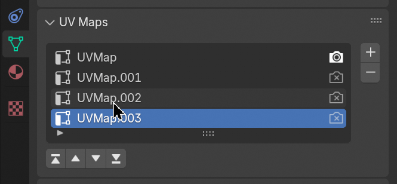

# blender-uv-order-manager
A simple tool for rearranging UV order in Blender.

## How to use
1. Download the latest release from [here](https://github.com/umlearn/blender-uv-order-manager/releases).
2. Intall the plugin in Blender.
3. Turn on the plugin in the preferences, And you can use it like this:

